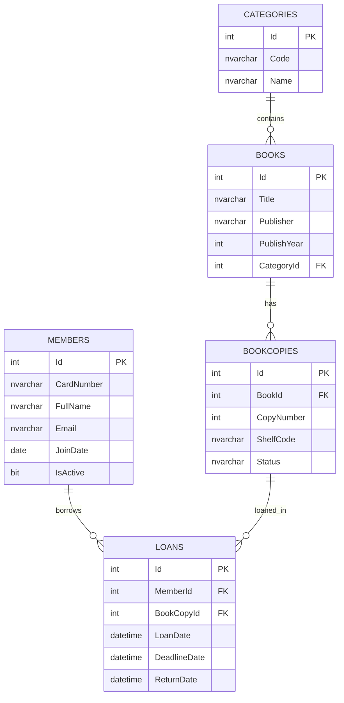

-- Preview kısmını(diyagramı oluşturabilmesi için) yazdığım kısım

```mermaid
erDiagram

    CATEGORIES {
        int Id PK
        nvarchar Code
        nvarchar Name
    }

    BOOKS {
        int Id PK
        nvarchar Title
        nvarchar Publisher
        int PublishYear
        int CategoryId FK
    }

    BOOKCOPIES {
        int Id PK
        int BookId FK
        int CopyNumber
        nvarchar ShelfCode
        nvarchar Status
    }

    MEMBERS {
        int Id PK
        nvarchar CardNumber
        nvarchar FullName
        nvarchar Email
        date JoinDate
        bit IsActive
    }

    LOANS {
        int Id PK
        int MemberId FK
        int BookCopyId FK
        datetime LoanDate
        datetime DeadlineDate
        datetime ReturnDate
    }

    CATEGORIES ||--o{ BOOKS : contains
    BOOKS ||--o{ BOOKCOPIES : has
    MEMBERS ||--o{ LOANS : borrows
    BOOKCOPIES ||--o{ LOANS : loaned_in
```

